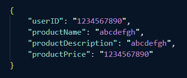
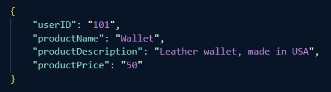
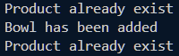
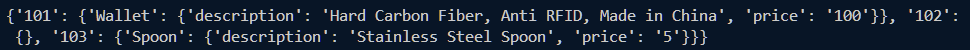
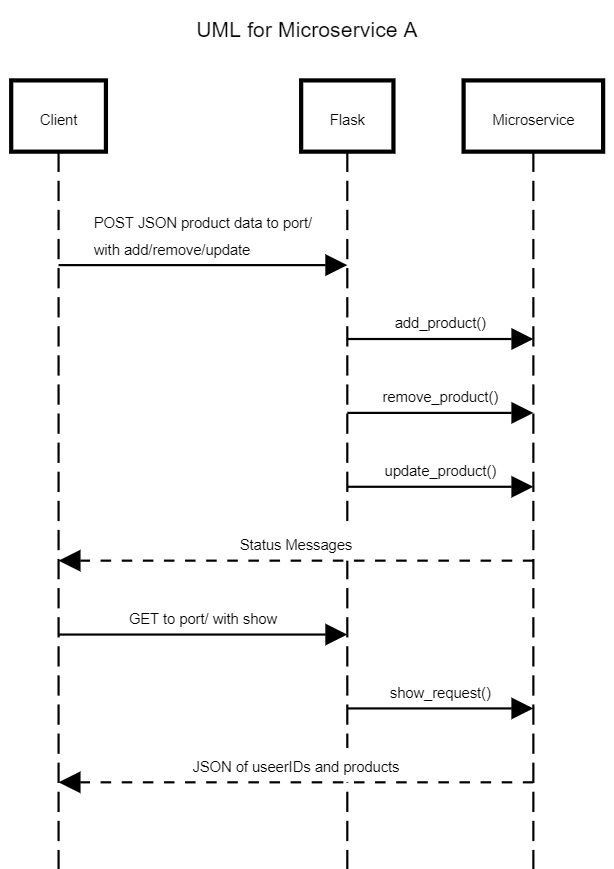

Microservice A for CS 361 Teammate

# Communication Contract

## Requirements

```python
pip install Flask
pip install requests
```

##

Port: 12345

### **Add/Remove/Update**

Method: POST

Input Format



Example JSON



Example Call

```python
import requests

response = requests.post("http://127.0.0.1:12345/add", json = *above example*)

print(reponse.text) # Return messages
```



### **Show**

Method: GET

Example Call

```python
import requests

response = requests.get("http://127.0.0.1:12345/show")

print(reponse.json())
```



